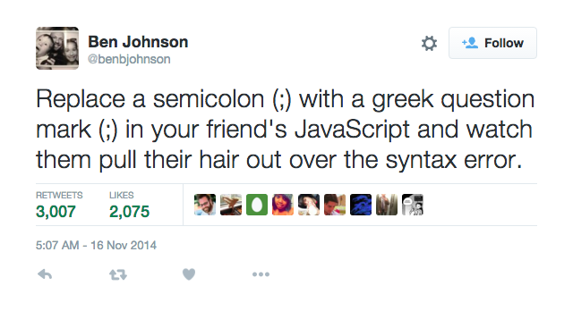

# semicolon-troll

Inspired by [this tweet](https://twitter.com/benbjohnson/status/533848879423578112):

The install/uninstall scripts were copied wholesale from [observing/pre-commit@1.1.2](https://github.com/observing/pre-commit/tree/3f83f7298928186335a34424c02088d1c6e358b5)

## Usage

- `npm install semicolon-troll`
- That's it!

## When enough is enough

- `npm uninstall semicolon-troll` will remove the pre-commit hook.

## What does it do
- Installs a Git pre-commit hook that will replace all semicolons in staged JavaScript files with greek question marks.
- Stages those changes for committing.
